# CareCompanion System Architecture

```mermaid
graph TB
    subgraph "Physical Hardware Layer"
        ESP32[ESP32 Microcontroller<br/>- WiFi Connectivity<br/>- Web Server on Port 80<br/>- I2C Communication]
        VS[Vibration Sensor<br/>SW-420<br/>Pin 26]
        PIR[PIR Motion Sensor<br/>Pin 13]
        DHT[DHT11 Sensor<br/>Temp & Humidity<br/>Pin 4]
        OLED[OLED Display<br/>SSD1306 128x32<br/>SDA: Pin 21, SCL: Pin 22]
        RELAY[Relay Module<br/>Pin 25<br/>Controls Buzzer]
        BUZZER[Emergency Buzzer<br/>Connected via Relay]
        
        VS --> ESP32
        PIR --> ESP32
        DHT --> ESP32
        ESP32 --> OLED
        ESP32 --> RELAY
        RELAY --> BUZZER
    end
    
    subgraph "Network Layer"
        WIFI[WiFi Network<br/>SSID: Tung Sahur]
        ESP32 --> WIFI
    end
    
    subgraph "Backend Infrastructure"
        SERVER[Web Server<br/>carecompanion.threelittlecar.com]
        DB[(Database<br/>MySQL/PHP Backend)]
        
        subgraph "API Endpoints"
            DHT_API[dht_insert.php<br/>Temperature & Humidity Data]
            PIR_API[pir_insert.php<br/>Motion Detection Data]
            VS_API[vs_insert.php<br/>Fall Detection Data]
            RELAY_UPDATE[relay_update.php<br/>Relay Status Updates]
            GET_DHT[get_latest_dht.php<br/>Latest Environment Data]
            GET_PIR[get_latest_pir.php<br/>Latest Motion Status]
            GET_VS[get_latest_vibration.php<br/>Latest Fall Status]
            GET_RELAY[get_relay_status.php<br/>Current Relay Status]
            RELAY_CTRL[relay_control.php<br/>App Relay Control]
            DHT_HIST[get_dht_history.php<br/>Historical Environment Data]
            ACT_HIST[get_activity_history.php<br/>Historical Activity Data]
        end
        
        SERVER --> DB
        DHT_API --> DB
        PIR_API --> DB
        VS_API --> DB
        RELAY_UPDATE --> DB
        DB --> GET_DHT
        DB --> GET_PIR
        DB --> GET_VS
        DB --> GET_RELAY
        DB --> DHT_HIST
        DB --> ACT_HIST
    end
    
    subgraph "Mobile Application Layer"
        APP[Flutter Mobile App<br/>CareCompanion]
        
        subgraph "App Services"
            SENSOR_SVC[SensorService<br/>Data Management & API Calls]
            CONFIG[AppConfig<br/>Configuration & Endpoints]
        end
        
        subgraph "App Screens"
            SPLASH[Splash Screen<br/>App Initialization]
            HOME[Home Dashboard<br/>Overview & Status]
            LIVE[Live Sensor Page<br/>Real-time Data]
            CONTROL[Relay Control Page<br/>Emergency Management]
            GRAPHS[Graphs & Trends<br/>Historical Analysis]
        end
        
        APP --> SENSOR_SVC
        APP --> CONFIG
        SENSOR_SVC --> HOME
        SENSOR_SVC --> LIVE
        SENSOR_SVC --> CONTROL
        SENSOR_SVC --> GRAPHS
    end
    
    subgraph "Data Flow & Communication"
        subgraph "ESP32 to Backend"
            ESP32 -.->|HTTP GET Every 15s| DHT_API
            ESP32 -.->|HTTP GET When Motion Detected| PIR_API
            ESP32 -.->|HTTP GET When Fall Detected| VS_API
            ESP32 -.->|HTTP GET When Relay Changes| RELAY_UPDATE
        end
        
        subgraph "App to Backend"
            SENSOR_SVC -.->|HTTP GET Every 5s| GET_DHT
            SENSOR_SVC -.->|HTTP GET Every 5s| GET_PIR
            SENSOR_SVC -.->|HTTP GET Every 5s| GET_VS
            SENSOR_SVC -.->|HTTP GET Every 3s| GET_RELAY
            CONTROL -.->|HTTP GET On User Action| RELAY_CTRL
            GRAPHS -.->|HTTP GET On Load| DHT_HIST
            GRAPHS -.->|HTTP GET On Load| ACT_HIST
        end
        
        subgraph "ESP32 to App Direct"
            ESP32 -.->|Local Web Server Port 80| APP
            APP -.->|Direct API Calls for Relay Control| ESP32
        end
    end
    
    subgraph "System Features"
        FALL[Fall Detection<br/>- Vibration sensor monitoring<br/>- 5-second cooldown<br/>- Emergency relay trigger<br/>- OLED emergency display]
        MOTION[Motion Detection<br/>- 10-second sustained motion<br/>- Inactivity alerts after 5 minutes<br/>- Activity tracking]
        ENV[Environmental Monitoring<br/>- Temperature: 18°C - 28°C<br/>- Humidity: 30% - 70%<br/>- 15-second intervals]
        ALERT[Alert Management<br/>- App-controlled relay<br/>- No auto-shutdown<br/>- Real-time notifications]
    end
    
    subgraph "Technical Specifications"
        TIMING[Timing Intervals<br/>DHT Data: Every 15s<br/>PIR Check: Every 1s<br/>Relay Check: Every 5s<br/>App Refresh: Every 5s<br/>Vibration: Real-time]
        THRESH[Thresholds<br/>High Temp: >28°C<br/>Low Temp: <18°C<br/>High Humidity: >70%<br/>Low Humidity: <30%<br/>Inactivity: 5 minutes]
    end
    
    style ESP32 fill:#e1f5fe
    style APP fill:#f3e5f5
    style SERVER fill:#e8f5e8
    style DB fill:#fff3e0
    style FALL fill:#ffebee
    style MOTION fill:#e0f2f1
    style ENV fill:#f1f8e9
    style ALERT fill:#fce4ec
```



## How to Convert to PNG:

### Method 1: Online Mermaid Editor
1. Go to https://mermaid.live/
2. Copy the above mermaid code
3. Paste it in the editor
4. Click the "Download PNG" button

### Method 2: GitHub
1. Create a new GitHub repository
2. Add this markdown file
3. GitHub will automatically render the Mermaid diagram
4. Right-click and save the rendered diagram as PNG

### Method 3: VS Code Extension
1. Install "Mermaid Preview" extension in VS Code
2. Open this markdown file
3. Use the preview to export as PNG

### Method 4: Command Line (if you have Node.js)
```bash
npm install -g @mermaid-js/mermaid-cli
mmdc -i system_architecture.md -o system_architecture.png
``` 